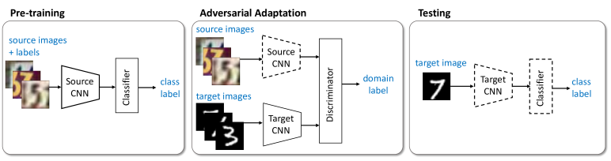

# Adversarial Discriminative Domain Adaptation
# Authors: Eric Tzeng, Judy Hoffman, Kate Saenko, Trevor Darrell

PyTorch implementation of the paper.

## Architecture
<p align="center">
  
</p>
ADDA consists of 4 models: source feature extractor(S), target feature extractor(T), classifier(C) and domain discriminator(D).
F and T and based on LeNet.
C and D are simple MLPs.


## Setup
### Installation
```shell
pip install -r requirements.txt
```

### Training
To run the training scripts:
```shell
chmod +x train.sh
./train.sh
```

Training is done in 2 stages.

In the first stage, called pre-training, S and C are trained on source images.

The second stage, called adversaral adaptation, trains T and D.
Weights of T are initialized by weights of S learned during pre-training.
In one step of adversarial adaptation, source image features are extracted using S
and target image features are extracted using T. Then, these features are fed to D
to gain domain prediction. D is trying to push source domain predictions to 1 and
target domain predictions to 0, while T is trying to push target domain predictions
to 1.

Finally, target domain images can be classified using T and C.

## Results
### Digits

| Methods              | MNIST -> USPS | USPS -> MNIST | SVHN -> MNIST    |
| ---                  | ---           | ---           | ---              |
| Train on source only | 0.752 ± 0.016 | 0.571 ± 0.017 | 0.601 ± 0.011    |
| Gradient reversal    | 0.771 ± 0.018 | 0.730 ± 0.020 | 0.739            |
| Domain confusion     | 0.791 ± 0.005 | 0.665 ± 0.033 | 0.681 ± 0.003    |
| CoGAN                | 0.912 ± 0.008 | 0.891 ± 0.008 | doesn't converge |
| ADDA                 | 0.894 ± 0.002 | 0.901 ± 0.008 | 0.760 ± 0.018    |


## References
[arxiv](https://arxiv.org/abs/1702.05464)
